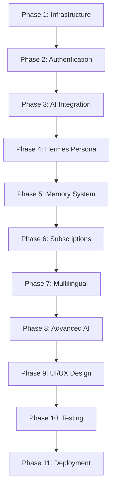

# IALchemist.app Implementation Plan - Phase Guide

## 🚀 Overview

This directory contains the comprehensive implementation plan for **IALchemist.app** - an AI-powered application where users communicate with Hermes Trismegistus, the legendary figure of Hermeticism and alchemy.

The implementation is divided into **11 manageable phases**, each designed to be completed by AI coders within 250k token windows. Each phase builds upon the previous ones and includes verification steps to ensure quality.

## 📋 Implementation Phases

### Phase 1: Core Infrastructure & Database Setup

**File:** `phase1-infrastructure.md`

- PostgreSQL + PGVector setup
- Comprehensive database schema
- Prisma ORM configuration
- Environment configuration
- Logging and error handling

### Phase 2: Authentication System Enhancement

**File:** `phase2-authentication.md`

- NextAuth.js v5 integration
- User registration & email verification
- Password reset functionality
- Protected routes
- OAuth providers setup

### Phase 3: Vercel AI SDK v5 Integration

**File:** `phase3-ai-integration.md`

- AI SDK configuration
- GPT-5 model integration
- Streaming chat interface
- Message persistence
- Conversation management

### Phase 4: Hermes Persona Development

**File:** `phase4-hermes-persona.md`

- Complete Hermes Trismegistus persona
- Hermetic knowledge base
- Age-appropriate teaching levels
- Transformation guidance system
- Daily practices database

### Phase 5: Conversation Memory System

**File:** `phase5-memory-system.md`

- Vector embeddings for semantic search
- Conversation search & filtering
- Spiritual journey timeline
- Export functionality (PDF, Markdown, JSON)
- Privacy controls

### Phase 6: Subscription & Payment System

**File:** `phase6-subscription-payment.md`

- Stripe integration
- Three subscription tiers (Seeker, Adept, Master)
- Usage tracking and limits
- Billing management
- Webhook handling

### Phase 7: Multilingual Implementation

**File:** `phase7-multilingual.md`

- Support for 7+ languages
- Dynamic language detection
- Culturally adapted content
- Localized hermetic teachings
- RTL support preparation

### Phase 8: Advanced AI Features

**File:** `phase8-advanced-ai.md`

- AI tool calling system
- Ritual generation
- Dream interpretation
- GPT-5 thinking mode
- Transformation programs

### Phase 9: UI/UX & Mystical Design

**File:** `phase9-ui-design.md`

- Mystical design system
- Sacred geometry components
- Alchemical symbols
- Particle effects
- Immersive chat interface

### Phase 10: Testing & Optimization

**File:** `phase10-testing-optimization.md`

- Unit & integration testing
- E2E test suite
- Performance optimization
- Bundle optimization
- Monitoring setup

### Phase 11: Production Deployment

**File:** `phase11-production-deployment.md`

- Vercel deployment
- Security hardening
- Domain configuration
- Launch checklist
- Post-launch monitoring

## 🛠️ Implementation Guidelines

### For AI Coders

1. **Start with Phase 1** and complete each phase sequentially
2. **After each phase**, run:
   ```bash
   pnpm lint    # Fix all linting issues
   pnpm build   # Fix all build errors
   ```
3. **Verify success criteria** at the end of each phase
4. **Don't skip phases** - each builds on previous work
5. **Test incrementally** - ensure each phase works before moving on

### Key Technologies

- **Framework:** Next.js 15.4.6 with App Router
- **Language:** TypeScript (strict mode)
- **Database:** PostgreSQL with PGVector
- **AI:** Vercel AI SDK v5 with GPT-5
- **Auth:** NextAuth.js v5
- **Payments:** Stripe
- **Styling:** Tailwind CSS v4
- **Deployment:** Vercel

### Environment Setup

Each phase includes specific environment variables. Create `.env.local` with:

```env
# See phase1-infrastructure.md for complete list
DATABASE_URL="..."
OPENAI_API_KEY="..."
STRIPE_SECRET_KEY="..."
# ... etc
```

## 📝 Phase Implementation Order



## ✅ Success Metrics

Each phase includes specific success criteria. Overall project success requires:

- [ ] All 11 phases completed
- [ ] All tests passing (>70% coverage)
- [ ] Lighthouse scores >90
- [ ] Build completes without errors
- [ ] No linting errors
- [ ] Production deployment successful

## 🚨 Important Notes

1. **Token Window Management**: Each phase is designed to fit within 250k tokens for AI implementation
2. **Incremental Development**: Complete and verify each phase before proceeding
3. **Testing Required**: Run tests after each major change
4. **Documentation**: Each phase includes inline documentation
5. **Error Handling**: Comprehensive error handling is built into each phase

## 📊 Estimated Timeline

- **Phase 1-3**: Foundation (1 week)
- **Phase 4-6**: Core Features (1-2 weeks)
- **Phase 7-9**: Enhancement (1-2 weeks)
- **Phase 10-11**: Launch Prep (1 week)
- **Total**: 4-6 weeks for complete implementation

## 🆘 Troubleshooting

If you encounter issues:

1. Check the specific phase documentation
2. Ensure all dependencies are installed: `pnpm install`
3. Verify environment variables are set correctly
4. Run `pnpm prisma generate` after schema changes
5. Clear cache if needed: `rm -rf .next node_modules`

## 🎯 Final Deliverable

Upon completing all phases, you will have:

- ✨ Fully functional IALchemist.app
- 🌍 Multilingual support (7+ languages)
- 🤖 Advanced AI with Hermes Trismegistus persona
- 💳 Complete subscription system
- 🔒 Secure authentication
- 📊 Comprehensive analytics
- 🚀 Production-ready deployment

## 📚 Additional Resources

- [Next.js Documentation](https://nextjs.org/docs)
- [Vercel AI SDK v5 Docs](https://sdk.vercel.ai/docs)
- [Prisma Documentation](https://www.prisma.io/docs)
- [Stripe Documentation](https://stripe.com/docs)

---

**Remember**: After every phase, run `pnpm lint` and `pnpm build` to ensure code quality and fix any issues before proceeding to the next phase.

Good luck with the implementation! May Hermes guide your code. 🌟
